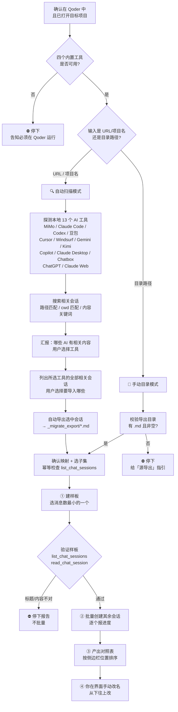

<div align="center">

# migrate-conversations-to-qoder

**把任意 AI 工具的历史对话，批量搬进 Qoder，变成一个个能接着聊的独立会话。**

自动扫描本地 **13 个主流 AI 工具**（MiMo / Claude Code / Codex / 豆包 / Cursor / Windsurf / Gemini CLI / Kimi Code / Copilot / Claude Desktop / Chatbox / ChatGPT / Claude Web），找到与当前项目相关的会话，由你选择后一键导入。

[](./LICENSE)
[](./SKILL.md)
[](./SKILL.md)
[](./SKILL.md)

</div>

> 💡 **看不懂怎么用？** 别啃文档——**在 Qoder 里打开目标项目、新建一个对话**，把这个仓库（或这份 README）扔给它，说一句「按这个帮我把对话迁进 Qoder」，让它读完替你做就行。
>
> ⚠️ **必须在 Qoder 里做。** 本技能依赖 Qoder 内置的 `create_chat_session` / `list_chat_sessions` / `read_chat_session` / `wait_chat_sessions` 工具。在 **Trae / Cursor / Claude Code / 其它任何环境**里这些工具**不存在**，助手读完也只会发现做不了——别在那儿试。

---

## 目录

- [它解决什么问题](#它解决什么问题)
- [支持的 AI 工具](#支持的-ai-工具)
- [两种模式](#两种模式)
- [工作原理](#工作原理)
- [使用前提（先读这一段）](#使用前提先读这一段)
- [安装](#安装)
- [使用方法（详细）](#使用方法详细)
- [完整实操示例](#完整实操示例)
- [标题是怎么来的](#标题是怎么来的)
- [手动改名指引](#手动改名指引)
- [常见问题 FAQ](#常见问题-faq)
- [已知限制](#已知限制)
- [License](#license)

---

## 它解决什么问题

你想把在别的 AI 工具里积累的历史对话搬到 **Qoder**，并且**每个对话都能在 Qoder 里打开、接着往下聊**。但是：

- Qoder 官方「数据导入」**只认自家** Quest / QoderWork，不认第三方对话。
- 现成工具（如 [SessionHarbor](https://github.com/Delight0628/SessionHarbor)）能读部分源，但**没有 Qoder 适配器**。
- Qoder 会话的标题存在**加密的 `state.json`** 里，外部**无法直接写入或伪造**。

本技能改走一条务实路线：**自动扫描本地 AI 工具 → 找到相关会话 → 导出成 Markdown → 用 `create_chat_session` 为每个对话建一个「种子会话」**，会话首轮先 `Read` 自己的历史文件，之后就成为一个带着完整上下文、可继续对话的独立 Qoder 会话。

## 支持的 AI 工具

### ✅ 自动扫描直读（本地明文数据，无需手动导出）

| 工具 | 数据位置 | 格式 | 项目匹配方式 |
|---|---|---|---|
| **MiMo（小米）** | `~/.local/share/mimocode/mimocode.db` | SQLite | 搜索标题+消息内容 |
| **Claude Code** | `~/.claude/projects/<项目路径转义>/` | JSONL | 目录名 = 项目路径（精确） |
| **Codex CLI（OpenAI）** | `~/.codex/sessions/YYYY/MM/DD/` | JSONL | `session_meta.cwd` = 项目路径 |
| **豆包 Doubao（字节）** | `%LOCALAPPDATA%/Doubao/.../trajectory.jsonl` | JSONL | 搜索消息内容 |
| **Cursor** | `%APPDATA%/Cursor/User/workspaceStorage/` | SQLite | `workspace.json.folder` = 项目路径 |
| **Windsurf** | `%APPDATA%/Windsurf/User/workspaceStorage/` | SQLite | 同 Cursor |
| **Gemini CLI** | `~/.gemini/` | JSONL/JSON | 搜索消息内容 |
| **Kimi Code CLI** | `~/.kimi-code/` | JSONL/JSON | 搜索消息内容 |
| **GitHub Copilot CLI** | `~/.copilot/session-state/` | SQLite/JSONL | 搜索消息内容 |
| **Claude Desktop** | `%APPDATA%/Claude/sessions/` | JSONL | 搜索消息内容 |
| **Chatbox** | `%APPDATA%/xyz.chatboxapp.app/config.json` | JSON | 搜索对话名+内容 |

### ⚠️ 需先手动导出（官方导出文件放到 Downloads）

| 工具 | 导出方式 |
|---|---|
| **ChatGPT（Web/桌面）** | Settings → Data controls → Export data |
| **Claude（Web）** | Settings → Privacy → Export data |

### ❌ 不支持

| 工具 | 原因 |
|---|---|
| **Trae（字节）** | 对话在 SQLCipher 加密库中，无法读取 |
| **Perplexity / 文心一言 / 通义千问** | 纯 Web 服务，无本地结构化对话数据 |

## 两种模式

### 自动扫描模式（推荐）

你只需要给出一个 **GitHub URL 或项目名**，技能会：

1. 自动探测本地 13 个 AI 工具中哪些存有数据
2. 在这些工具中搜索与该项目相关的会话
3. 告诉你「哪些 AI 里有相关内容」，由你选择要查看哪些工具
4. 列出所选工具中的全部相关会话，由你选择要导入哪些
5. 自动将选中的会话导出为 `.md`，然后导入 Qoder

```
/migrate-conversations-to-qoder https://github.com/YTZ-create/OpenClaw
```

### 手动目录模式

如果你已经自己把对话导出成了 `.md` 文件夹，直接指定目录：

```
/migrate-conversations-to-qoder mimo-conversations/ _index.md
```

## 工作原理



## 使用前提（先读这一段）

1. **在 Qoder 里运行，并且已打开目标项目文件夹。** `create_chat_session` **不能指定目录**，会话会落在「当前 Qoder 工作区」。
2. **自动扫描模式**：本地 AI 工具的数据必须可读（明文 SQLite / JSONL / JSON）。ChatGPT / Claude Web 需先从官方下载导出文件。
3. **加密库不破解。** Trae 等使用 SQLCipher 加密的工具会被跳过。

> 🔎 技能开跑后会先做一轮**自检**，任何一项不过就**立即停下并告诉你怎么做**，不会闷头建一堆删不掉的会话。

## 安装

**用户级**（推荐，任何项目都能用）：

```bash
git clone https://github.com/YTZ-create/migrate-conversations-to-qoder.git \
  ~/.qoder-cn/skills/migrate-conversations-to-qoder
```

**项目级**（只在某个项目可用）：

```bash
git clone https://github.com/YTZ-create/migrate-conversations-to-qoder.git \
  <你的项目>/.qoder/skills/migrate-conversations-to-qoder
```

装好后：

```
/skills reload      # 或重启会话
/skills list        # 确认能看到 migrate-conversations-to-qoder
```

## 使用方法（详细）

### 自动扫描模式

#### 第 1 步 · 进对项目

在 Qoder 里**打开目标项目文件夹**，**新建一个对话**。

#### 第 2 步 · 调用技能

```
/migrate-conversations-to-qoder https://github.com/YTZ-create/OpenClaw
```

或者直接给项目名：

```
/migrate-conversations-to-qoder OpenClaw
```

#### 第 3 步 · 查看扫描结果

技能会探测本地 13 个 AI 工具并汇报：

```
本地 AI 工具扫描结果（共探测 13 个源）：

✅ MiMo         — 找到 mimocode.db，5 个相关会话
✅ Claude Code  — 找到项目目录，12 个会话（精确匹配）
✅ Codex CLI    — 找到 3 个会话（cwd 匹配）
✅ 豆包 Doubao  — 找到 2 个相关会话
⚠️ ChatGPT      — 未找到导出文件（需先手动导出）
❌ Windsurf     — 未安装
❌ Trae         — 不支持（加密库）

请选择要查看的工具（输入序号，或 all）：
```

#### 第 4 步 · 选择要导入的会话

```
=== Claude Code · 项目 OpenClaw（共 12 个会话）===

[1] 2026-08-10 | 把目前的 OpenClaw-CN 迁移到...  | 约 45 条消息
[2] 2026-08-15 | 帮我看看这个 agent 的架构...     | 约 23 条消息
...

=== 豆包 Doubao（共 2 个会话）===

[13] 2026-09-01 | 我主导开发了开源桌面 AI 项目...  | 约 8 条消息
[14] 2026-09-05 | OpenClaw 的 README 怎么写...    | 约 12 条消息

请选择要导入的会话（输入序号，多个用逗号分隔，或 all）：
```

#### 第 5 步 · 自动导出 + 导入

技能自动将选中的会话导出为 `.md`（存放在工作区的 `_migrate_export/` 临时目录），然后走样板验证 → 批量创建流程。

#### 第 6 步 · 收对照表、手动改名

技能输出按侧边栏位置排序的对照表，你在 Qoder 界面手动改名。完成后可删除 `_migrate_export/` 目录。

---

### 手动目录模式

#### 第 1 步 · 进对项目

在 Qoder 里**打开目标项目文件夹**，**新建一个对话**。

#### 第 2 步 · 调用技能

```
/migrate-conversations-to-qoder <导出目录> [索引文件]
```

#### 第 3 步 · 确认映射（可只迁一部分）

技能扫描目录、生成映射并贴给你确认。想只迁一部分？在这一步指定序号即可。

#### 第 4 步 · 样板先行

技能只先建 1 个（消息数最小的），验证标题和内容。

#### 第 5 步 · 批量创建

样板通过后，逐个创建其余会话，每建一个报一次进度。

#### 第 6 步 · 收对照表、手动改名

| 位置（从上往下第 N 个） | 自动标题 | 目标标题 | 来源工具 | 是否需改名 |
|---|---|---|---|---|

## 完整实操示例

### 示例 1：自动扫描（多工具）

```text
# 在 Qoder 打开 C:\Users\<你>\Desktop\OpenClaw，新建对话，发送：
/migrate-conversations-to-qoder https://github.com/YTZ-create/OpenClaw

# 技能自动：
# → 探测 13 个源，发现 Claude Code(12) + Codex(3) + MiMo(5) + 豆包(2) 有相关会话
# → 你选 all
# → 列出 22 个会话，你选 1,2,3,5,13,14
# → 自动导出 6 个 .md 到 _migrate_export/
# → 建样板验证 → 批量创建 → 给你对照表
```

### 示例 2：手动目录

```text
/migrate-conversations-to-qoder mimo-conversations/ _index.md
```

## 标题是怎么来的

`create_chat_session` 只有 `prompt` 一个入参，**没有 title 参数**。Qoder 的会话标题是它**对种子 prompt 自动概括**生成的。技能把目标标题放在种子 prompt 首行来偏置，但不保证逐字。

> 💡 多个标题可能撞车时，**加序号前缀**（如 `[03] 标题`）能进一步区分。

## 手动改名指引

1. 右键会话 → **重命名**。
2. **按「位置」对照**：Qoder 不显示 sessionId，靠"从上往下数第几个"定位。
3. **从下往上改**：改名会把该会话顶到列表最前，从底部开始改才不会乱。

## 常见问题 FAQ

**Q：自动扫描支持哪些 AI 工具？**
A：13 个源——MiMo、Claude Code、Codex CLI、豆包、Cursor、Windsurf、Gemini CLI、Kimi Code、Copilot CLI、Claude Desktop、Chatbox（以上直读）；ChatGPT、Claude Web（需先官方导出）。Trae / Perplexity / 文心一言 / 通义千问不支持。

**Q：自动扫描会修改我的源数据吗？**
A：不会。全程只读。导出的临时 `.md` 存放在 `_migrate_export/`，导入完成后可删。

**Q：Claude Code 的匹配为什么最精确？**
A：Claude Code 按项目路径建目录（`~/.claude/projects/c--Users-xxx-Desktop-OpenClaw/`），目录名就是项目路径的转义，无需内容搜索。

**Q：Codex CLI 怎么知道是哪个项目？**
A：每个 JSONL 首行有 `session_meta.cwd` 字段，记录了当时的项目绝对路径。

**Q：豆包没有 cwd 字段怎么办？**
A：豆包只能靠内容关键词匹配（搜索 URL / 仓库名 / 文件夹名），可能有漏网之鱼。

**Q：Cursor / Windsurf 的对话在 SQLite 里怎么读？**
A：表 `cursorDiskKV`（Cursor）或 `ItemTable`（Windsurf），key 含 `bubbleId` 前缀，value 是 JSON 字符串，需二次解析。

**Q：我把它扔给了 Trae / Cursor，为什么没反应？**
A：那些环境没有 Qoder 内置工具，技能跑不起来。请在 **Qoder** 里使用。

**Q：建错了会话怎么删？**
A：工具删不掉，只能在 Qoder 界面右键 → 归档/删除；一次错多个时**从下往上**处理。

**Q：迁过来的会话真的能接着聊吗？**
A：能。种子会话首轮 Read 了完整历史 `.md` 作为上下文，之后正常发消息即可延续。

## 已知限制

- **仅限 Qoder**，且必须在目标项目里运行。
- **Trae 不支持**（SQLCipher 加密）；Perplexity / 文心一言 / 通义千问无本地数据。
- ChatGPT / Claude Web 需用户先手动下载官方导出文件。
- 标题为**偏置**，非精确；个别需手动改名。
- 会话创建**不可逆**（工具层面），错了只能在 UI 手动删。
- 不迁移「记忆/memory」。
- 内容关键词匹配可能漏掉未明确提及项目名的相关会话。
- 豆包普通聊天（非 agent 模式）可能存在 LevelDB 中，解析较复杂，优先读 trajectory.jsonl。

## License

[MIT](./LICENSE) © 2026 YTZ-create
