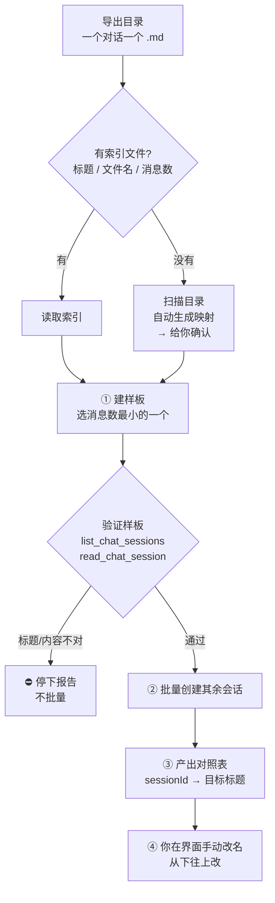
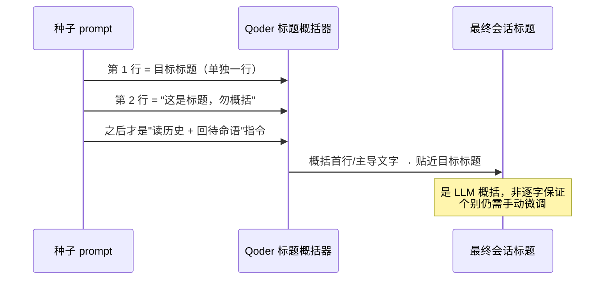

<div align="center">

# migrate-conversations-to-qoder

**把任意 AI 工具导出的对话，批量搬进 Qoder，变成一个个能接着聊的独立会话。**

Batch-migrate exported conversation Markdown (MiMo / ChatGPT / Claude / any source) into independent, resumable Qoder sessions — preserving each original title as closely as possible.

[](./LICENSE)
[](./SKILL.md)
[](./SKILL.md)

</div>

---

## 目录

- [它解决什么问题](#它解决什么问题)
- [工作原理](#工作原理)
- [前置条件](#前置条件)
- [安装](#安装)
- [使用方法（详细）](#使用方法详细)
- [完整实操示例](#完整实操示例)
- [标题是怎么来的](#标题是怎么来的)
- [手动改名指引](#手动改名指引)
- [常见问题 FAQ](#常见问题-faq)
- [已知限制](#已知限制)
- [License](#license)

---

## 它解决什么问题

你想把在别的 AI 工具（比如**小米 MiMo**）里积累的历史对话搬到 **Qoder**，并且**每个对话都能在 Qoder 里打开、接着往下聊**。但是：

- Qoder 官方「数据导入」**只认自家** Quest / QoderWork，不认第三方对话。
- 现成工具（如 [SessionHarbor](https://github.com/Delight0628/SessionHarbor)）能读 MiMo、写 Claude Code JSONL，但**没有 Qoder 适配器、也不迁记忆**。
- Qoder 会话的标题存在**加密的 `state.json`** 里，外部**无法直接写入或伪造**。

本技能改走一条务实路线：**把对话导出成 Markdown → 用 `create_chat_session` 为每个对话建一个「种子会话」**，会话首轮先 `Read` 自己的历史文件，之后就成为一个带着完整上下文、可继续对话的独立 Qoder 会话。

## 工作原理



## 前置条件

1. **能导出对话为 Markdown。** 本技能不负责「从源 App 抽数据」，只负责「已有 `.md` → Qoder 会话」。你需要先把对话导出到一个文件夹，一个对话一个 `.md`。
2. **在目标项目文件夹里运行。** `create_chat_session` **不能指定目录**，会话会落在「当前 Qoder 工作区」。所以必须先在**要承接这些会话的项目**里打开 Qoder，否则会话落错项目、接着聊时取不到该项目的文件和记忆。
3. 一个可选的**索引文件**（表格含 `标题 | 文件名 | 消息数`）。没有也行，技能会扫目录自动生成并请你确认。

## 安装

**用户级**（推荐，任何项目都能用）：

```bash
git clone https://github.com/YTZ-create/migrate-conversations-to-qoder.git \
  ~/.qoder-cn/skills/migrate-conversations-to-qoder
```

**项目级**（只在某个项目可用）：

```bash
git clone https://github.com/YTZ-create/migrate-conversations-to-qoder.git \
  <你的项目>/.qoder/skills/migrate-conversations-to-qoder
```

装好后：

```
/skills reload      # 或重启会话
/skills list        # 确认能看到 migrate-conversations-to-qoder
```

## 使用方法（详细）

### 第 1 步 · 进对项目

在 Qoder 里**打开目标项目文件夹**，**新建一个对话**。这个对话是「调度台」——它来批量创建其它会话，本身不是被迁移的对话。

### 第 2 步 · 调用技能

```
/migrate-conversations-to-qoder <导出目录> [索引文件]
```

| 参数 | 必填 | 说明 |
|---|---|---|
| `<导出目录>` | 是 | 存放对话 `.md` 的文件夹，如 `mimo-conversations/` |
| `[索引文件]` | 否 | 含 `标题 \| 文件名 \| 消息数` 的清单，如 `_index.md`；缺省则自动扫描生成 |

### 第 3 步 · 确认映射

- 若你给了索引文件，技能直接采用。
- 若没有，技能会**扫描目录、生成「标题 → 文件名 → 消息数」映射并贴给你确认**，避免搬错顺序或漏搬。

### 第 4 步 · 样板先行（关键安全阀）

技能**只先建 1 个**——消息数最小的那个对话，然后自检：

- `list_chat_sessions` → 会话已注册？
- 自动生成的标题 ≈ 目标标题？
- `read_chat_session` → 已读历史、且只回了一句「历史已加载，可以接着聊」？

> ⚠️ **为什么必须先样板**：`create_chat_session` 建出来的会话**无法用任何工具删除**（只能在界面手动归档/删）。先拿 1 个验证，才不会一次性堆出十几个删不掉的错名会话。

### 第 5 步 · 批量创建

样板通过后，技能创建其余全部会话，用 `wait_chat_sessions` 跟踪完成。大文件（几百条消息）首轮 `Read` 可能因超长失败后**自动分段重读**，属正常，不会中断。

### 第 6 步 · 收对照表、手动改名

技能最后输出：创建了哪些会话（`sessionId` + 自动标题），以及一张 **`sessionId → 目标标题` 对照表**，标出需要手动改名的项。按下一节改名即可。

## 完整实操示例

以「把小米 MiMo 的 13 个对话迁进 OpenClaw 项目」为例：

```
# 1) 在 Qoder 打开 C:\Users\<你>\Desktop\OpenClaw，新建对话
# 2) 发送：
/migrate-conversations-to-qoder mimo-conversations/ _index.md
```

技能会：先建最小的「先详细了解这个项目」(41 条) 做样板 → 验证 → 再建其余 12 个 → 给你一张 13 行的改名对照表。完成后 Qoder 侧边栏多出 13 个可点开接着聊的会话。

## 标题是怎么来的

**核心事实**：`create_chat_session` 只有 `prompt` 一个入参，**没有 title 参数，也没有重命名工具**。Qoder 的会话标题是它**对种子 prompt 自动概括**生成的。

所以标题只能「偏置」，不能精确设定。技能的偏置策略：



> 💡 **踩坑提醒**：如果种子 prompt 通篇都是「读取文件、加载历史」，概括器就会老实总结成「加载历史对话」——十几个会话全同名。把**真实标题放到首行**才能纠偏。
>
> 💡 **另一个坑**：有些 App（如 MiMo）允许你在 UI 里改名，之后又用自动生成的长句**覆盖数据库里的 `title`**。做对照表时，**以你在 App 界面/截图看到的标题为准**，不要只信数据库字段。（侧边栏通常「最新在前」，与 `ORDER BY created DESC` 一一对应，可用来核对映射。）

## 手动改名指引

自动标题不保证逐字，最后一步在 Qoder 界面手动改名：

1. 右键会话 → **重命名**。
2. 若多个会话当前**同名**（占位名），靠**列表位置**对照 `sessionId` 区分。
3. **从下往上改**：改名会把该会话**顶到列表最前**，从最底部开始改，才能保证还没改的会话位置不动。

```
改之前(从上到下)   改之后(从下往上改)
┌──────────────┐   第13个先改 → 跳到顶部
│ 1  会话A      │   再改第12个 → 跳到顶部
│ ...          │   ...
│ 12 会话L      │   剩下没改的相对位置始终不变
│ 13 会话M      │
└──────────────┘
```

## 常见问题 FAQ

**Q：技能能帮我把对话从 MiMo/ChatGPT 里导出来吗？**
A：不能。本技能只做「已有 `.md` → Qoder 会话」。导出需你先用源工具或另写脚本完成。

**Q：为什么不能在创建时就把标题设对？**
A：`create_chat_session` 无 title 入参、标题存加密 `state.json`、也无重命名工具。只能靠首行偏置 + 事后手动改名。

**Q：建错了会话怎么删？**
A：工具删不掉，只能在 Qoder 界面手动归档/删除。所以务必走「样板先行」。

**Q：迁过来的会话真的能接着聊吗？**
A：能。种子会话首轮 `Read` 了完整历史 `.md` 作为上下文，之后你正常发消息即可延续该对话。

**Q：会话落到别的项目了怎么办？**
A：因为没在目标项目文件夹里执行。删掉重来前，先确认 Qoder 当前打开的就是目标项目。

## 已知限制

- 标题为**偏置**，非精确；个别需手动改名。
- 会话创建**不可逆**（工具层面）。
- 不负责源数据导出，也不迁移「记忆/memory」（记忆是纯 Markdown，可另行按 Qoder 分条格式转写）。

## License

[MIT](./LICENSE) © 2026 YTZ-create
