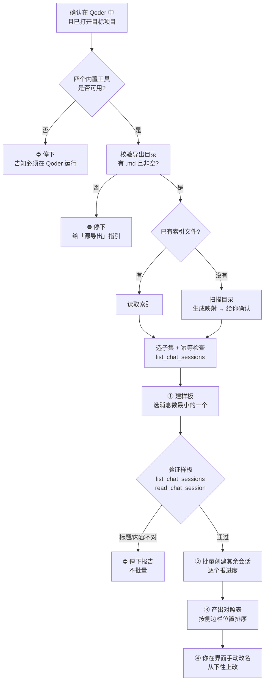
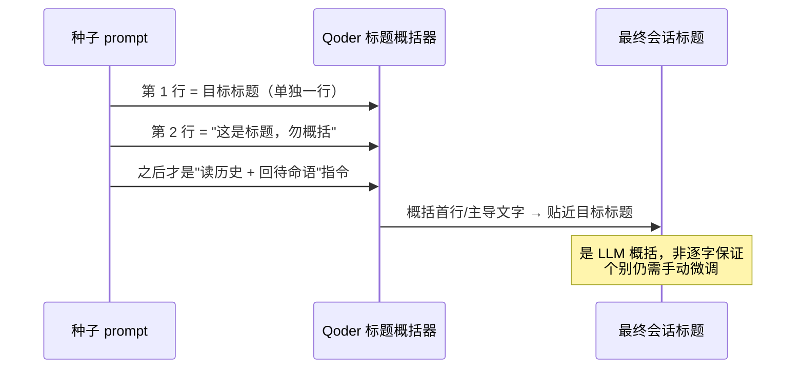

<div align="center">

# migrate-conversations-to-qoder

**把任意 AI 工具导出的对话，批量搬进 Qoder，变成一个个能接着聊的独立会话。**

Batch-migrate exported conversation Markdown (MiMo / ChatGPT / Claude / any source) into independent, resumable Qoder sessions — preserving each original title as closely as possible.

[](./LICENSE)
[](./SKILL.md)
[](./SKILL.md)

</div>

> 💡 **看不懂怎么用？** **在 Qoder 里打开目标项目、新建一个对话**，把这个仓库（或这份 README）扔给它，说一句「按这个帮我把对话迁进 Qoder」，让它读完替你做就行。
>
> ⚠️ **必须在 Qoder 里做。** 本技能依赖 Qoder 内置的 `create_chat_session` / `list_chat_sessions` / `read_chat_session` / `wait_chat_sessions` 工具。在 **Trae / Cursor / Claude Code / 其它任何环境**里这些工具**不存在**，AI读完也只会发现做不了——别在那儿试。

---

## 目录

- [它解决什么问题](#它解决什么问题)
- [工作原理](#工作原理)
- [使用前提（先读这一段）](#使用前提先读这一段)
- [源导出怎么弄](#源导出怎么弄)
- [安装](#安装)
- [使用方法（详细）](#使用方法详细)
- [完整实操示例](#完整实操示例)
- [标题是怎么来的](#标题是怎么来的)
- [手动改名指引](#手动改名指引)
- [常见问题 FAQ](#常见问题-faq)
- [已知限制](#已知限制)
- [License](#license)

---

## 它解决什么问题

你想把在别的 AI 工具（比如**小米 MiMo**）里积累的历史对话搬到 **Qoder**，并且**每个对话都能在 Qoder 里打开、接着往下聊**。但是：

- Qoder 官方「数据导入」**只认自家** Quest / QoderWork，不认第三方对话。
- 现成工具（如 [SessionHarbor](https://github.com/Delight0628/SessionHarbor)）能读 MiMo、写 Claude Code JSONL，但**没有 Qoder 适配器、也不迁记忆**。
- Qoder 会话的标题存在**加密的 `state.json`** 里，外部**无法直接写入或伪造**。

本技能改走一条务实路线：**把对话导出成 Markdown → 用 `create_chat_session` 为每个对话建一个「种子会话」**，会话首轮先 `Read` 自己的历史文件，之后就成为一个带着完整上下文、可继续对话的独立 Qoder 会话。

## 工作原理



## 使用前提（先读这一段）

这一步最容易卡住小白，务必先确认三条：

1. **在 Qoder 里运行，并且已打开目标项目文件夹。** `create_chat_session` **不能指定目录**，会话会落在「当前 Qoder 工作区」。所以必须先在**要承接这些会话的项目**里打开 Qoder、新建一个对话（这个对话是「调度台」，本身不被迁移）。
2. **你已经有导出的 `.md` 文件夹。** 本技能**不负责**从源 App 抽数据——见下一节。
3. **源是可读的。** 明文 SQLite / JSON / 文本 → 可以；**加密库 / 私有二进制格式 / 只有云端 → 不行，直接放弃自动迁移**（例如 Trae 的对话就在 SQLCipher 加密库里，没有任何导出接口）。

> 🔎 技能开跑后会先做一轮**自检**（工具是否齐全 / 是否在目标项目 / 导出目录是否存在且非空 / 是否已有同名会话），任何一项不过就**立即停下并告诉你怎么做**，不会闷头建一堆删不掉的会话。

## 源导出怎么弄

本技能**只做**「已有 `.md` → Qoder 会话」，**不负责**「从源 App 抽数据」。开始前先看你属于哪一类：

| 源 | 能否导出为 .md | 怎么做 |
|---|---|---|
| 小米 MiMo | ✅ 本地明文 SQLite | 从 `.../mimocode.db` 读取并导出，一个对话一个 .md |
| ChatGPT | ✅ 官方导出 | Settings → Data controls → Export data，下载 `conversations.json` 后转 .md |
| Claude | ✅ 官方导出 | Settings → Privacy → Export data |
| 其它带「导出 / 分享」的 App | ✅ | 用自带导出，或把内容复制出来另存为 .md |
| **Trae 等无导出功能、且本地库加密的 App** | ❌ **不支持** | 对话存在 SQLCipher 加密库中，无接口、无明文。**不要尝试**——只能手动复制内容另存为 .md，再用本技能 |

导出的目录长这样（一个对话一个 `.md`，可配一个索引文件）：

```
mimo-conversations/
├── _index.md                  # 可选：标题 | 文件名 | 消息数
├── 01_先详细了解这个项目.md
├── 02_xxx.md
└── ...
```

## 安装

**用户级**（推荐，任何项目都能用）：

```bash
git clone https://github.com/YTZ-create/migrate-conversations-to-qoder.git \
  ~/.qoder-cn/skills/migrate-conversations-to-qoder
```

**项目级**（只在某个项目可用）：

```bash
git clone https://github.com/YTZ-create/migrate-conversations-to-qoder.git \
  <你的项目>/.qoder/skills/migrate-conversations-to-qoder
```

装好后：

```
/skills reload      # 或重启会话
/skills list        # 确认能看到 migrate-conversations-to-qoder
```

## 使用方法（详细）

### 第 0 步 · 自检（技能自动做）

技能开跑先自检四项：**工具齐全 → 在目标项目 → 导出目录非空 → 无重复会话**。任一不过，技能会停下并给出指引（比如"你不在 Qoder 里"或"该源不支持导出"）。

### 第 1 步 · 进对项目

在 Qoder 里**打开目标项目文件夹**，**新建一个对话**。这个对话是「调度台」——它来批量创建其它会话，本身不是被迁移的对话。

### 第 2 步 · 调用技能

```
/migrate-conversations-to-qoder <导出目录> [索引文件]
```

| 参数 | 必填 | 说明 |
|---|---|---|
| `<导出目录>` | 是 | 存放对话 `.md` 的文件夹，如 `mimo-conversations/` |
| `[索引文件]` | 否 | 含 `标题 \| 文件名 \| 消息数` 的清单，如 `_index.md`；缺省则自动扫描生成 |

### 第 3 步 · 确认映射（可只迁一部分）

- 若你给了索引文件，技能直接采用；否则技能会**扫描目录、生成「标题 → 文件名 → 消息数」映射并贴给你确认**。
- 想**只迁其中一部分**？在这一步直接说（给文件名或序号），技能就只建你选的那些。
- 避免多个会话重名？可以让技能在标题前加序号前缀（如 `[03] 标题`）。

### 第 4 步 · 样板先行（关键安全阀）

技能**只先建 1 个**——消息数最小的那个对话，然后自检：

- `list_chat_sessions` → 会话已注册？
- 自动生成的标题 ≈ 目标标题？
- `read_chat_session` → 已读历史、且只回了一句「历史已加载，可以接着聊」？

> ⚠️ **为什么必须先样板**：`create_chat_session` 建出来的会话**无法用任何工具删除**（只能在界面手动归档/删）。先拿 1 个验证，才不会一次性堆出十几个删不掉的错名会话。

### 第 5 步 · 批量创建（有进度）

样板通过后，技能创建其余全部会话，**每建成一个就报一次进度**，并用 `wait_chat_sessions` 跟踪完成。大文件（几百条消息）首轮 `Read` 可能因超长失败后**自动分段重读**，属正常，不会中断。

### 第 6 步 · 收对照表、手动改名

技能最后输出**按侧边栏位置排序**的对照表：

| 位置（从上往下第 N 个） | 自动标题 | 目标标题 | 是否需改名 |
|---|---|---|---|

> 💡 为什么用「位置」而不是 sessionId？因为 **Qoder 界面根本不显示 `sessionId`**，你只能靠"从上往下数第几个"来定位。sessionId 会附在表后，仅供参考。

## 完整实操示例

以「把小米 MiMo 的 13 个对话迁进 OpenClaw 项目」为例：

```text
# 0) 先自己把对话导出成 .md（本技能不负责这步）
#    MiMo 是明文 SQLite：从 .../mimocode.db 读出来，一个对话存一个 .md
#    得到：OpenClaw/mimo-conversations/  内含 13 个 .md + _index.md

# 1) 在 Qoder 打开目标项目 C:\Users\<你>\Desktop\OpenClaw，新建对话
# 2) 发送：
/migrate-conversations-to-qoder mimo-conversations/ _index.md
```

技能会：自检 → 先建最小的「先详细了解这个项目」(41 条) 做样板 → 验证 → 再建其余 12 个（逐个报进度）→ 给你一张按位置排序的改名对照表。完成后 Qoder 侧边栏多出 13 个可点开接着聊的会话。

## 标题是怎么来的

**核心事实**：`create_chat_session` 只有 `prompt` 一个入参，**没有 title 参数，也没有重命名工具**。Qoder 的会话标题是它**对种子 prompt 自动概括**生成的。

所以标题只能「偏置」，不能精确设定。技能的偏置策略：



> 💡 **踩坑提醒**：如果种子 prompt 通篇都是「读取文件、加载历史」，概括器就会老实总结成「加载历史对话」——十几个会话全同名。把**真实标题放到首行**才能纠偏；多个标题可能撞车时，**加序号前缀**（如 `[03] 标题`）能进一步区分。
>
> 💡 **另一个坑**：有些 App（如 MiMo）允许你在 UI 里改名，之后又用自动生成的长句**覆盖数据库里的 `title`**。做对照表时，**以你在 App 界面/截图看到的标题为准**，不要只信数据库字段。（侧边栏通常「最新在前」，与 `ORDER BY created DESC` 一一对应，可用来核对映射。）

## 手动改名指引

自动标题不保证逐字，最后一步在 Qoder 界面手动改名：

1. 右键会话 → **重命名**。
2. **按「位置」对照**：Qoder 不显示 sessionId，所以先数清侧边栏**从上往下第 N 个**是你要改的那个（对着技能给的对照表）。
3. **从下往上改**：改名会把该会话**顶到列表最前**，从最底部开始改，才能保证还没改的会话位置不动。

```
改之前(从上到下)   改之后(从下往上改)
┌──────────────┐   第13个先改 → 跳到顶部
│ 1  会话A      │   再改第12个 → 跳到顶部
│ ...          │   ...
│ 12 会话L      │   剩下没改的相对位置始终不变
│ 13 会话M      │
└──────────────┘
```

## 常见问题 FAQ

**Q：技能能帮我把对话从 MiMo / ChatGPT / Trae 里导出来吗？**
A：不能。本技能只做「已有 `.md` → Qoder 会话」。ChatGPT / Claude / MiMo 有官方或明文途径可自行导出；**Trae 这类本地加密、无导出接口的 App 暂不支持**（只能手动复制内容另存 .md）。

**Q：我把它扔给了 Trae / Cursor，为什么没反应？**
A：那些环境没有 Qoder 内置的 `create_chat_session` 等工具，技能跑不起来。请在 **Qoder** 里、打开目标项目后使用。

**Q：为什么不能在创建时就把标题设对？**
A：`create_chat_session` 无 title 入参、标题存加密 `state.json`、也无重命名工具。只能靠首行偏置 + 事后手动改名。

**Q：建错了会话怎么删？**
A：工具删不掉，只能在 Qoder 界面右键 → 归档 / 删除；一次错多个时**从下往上**逐个处理。所以务必走「样板先行」。

**Q：迁过来的会话真的能接着聊吗？**
A：能。种子会话首轮 `Read` 了完整历史 `.md` 作为上下文，之后你正常发消息即可延续该对话。

**Q：会话落到别的项目了怎么办？**
A：因为没在目标项目文件夹里执行。删掉重来前，先确认 Qoder 当前打开的就是目标项目。

**Q：我只想迁其中几个，行吗？**
A：行。在技能让你确认映射的那一步，指定文件名或序号即可，只迁所选。

## 已知限制

- **仅限 Qoder**，且必须在目标项目里运行。
- **不负责源数据导出**：加密 / 无导出接口的源（如 Trae）不支持自动迁移。
- 标题为**偏置**，非精确；个别需手动改名，且**界面上要靠"位置"来对照**（不显示 sessionId）。
- 会话创建**不可逆**（工具层面），错了只能在 UI 手动删。
- 不迁移「记忆/memory」（记忆是纯 Markdown，可另行按 Qoder 分条格式转写）。

## License

[MIT](./LICENSE) © 2026 YTZ-create
